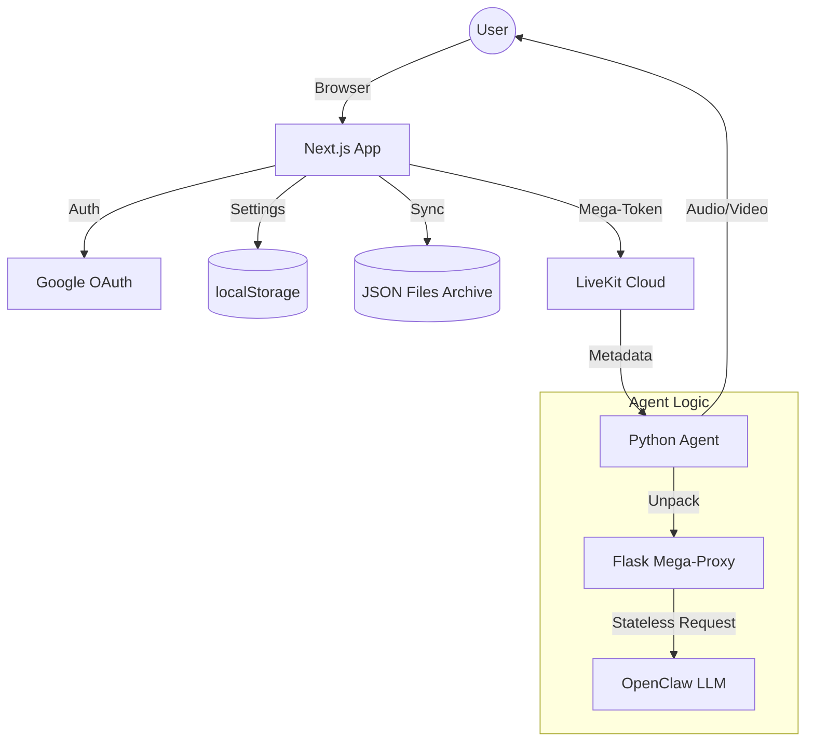

# ClawdFace: Production-Grade Voice AI Platform

ClawdFace is a high-performance, real-time Voice AI platform built with Next.js and LiveKit. It features a unique **Stateless / No-DB Architecture**, making it infinitely scalable and easy to deploy on serverless platforms like Vercel without the overhead of external databases.

---

## 🚀 Key Features

- **Stateless Architecture**: No external database (Supabase/Postgres) required. Uses "Mega-Tokens" for 100% stateless agent configuration.
- **Hybrid Storage**: Persistent user settings via `localStorage` (browser) with automated sync to local JSON files (`data/user-configs`) for development.
- **Production AI Stack**: Integrated with Deepgram (STT), OpenAI (LLM), ElevenLabs (TTS), and Trugen (Avatar).
- **OpenClaw Integration**: First-class support for OpenClaw custom LLM providers with session persistence.
- **Google Auth**: Secure, verified access using Google OAuth.
- **Premium UI**: Built with Framer Motion for smooth, glassmorphic interactions and real-time audio visualization.

---

## 🛠️ Technology Stack

| Layer | Technology |
| :--- | :--- |
| **Frontend** | Next.js 15+, React 18, TailwindCSS, Framer Motion |
| **Real-time** | LiveKit Cloud / @livekit/components-react |
| **Google Auth**| @react-oauth/google (Implicit Flow + Profile Sync) |
| **AI Agent** | Python 3.12+, livekit-agents framework |
| **Persistence** | Browser `localStorage` + JSON File Sync (Hybrid) |
| **Verification** | Environment Variables (`VERIFIED_EMAILS`) |
| **STT / TTS** | Deepgram Nova-2 / ElevenLabs Flash v2.5 |
| **Avatar** | Trugen AI |

---

## 🏗️ Architecture Overview

ClawdFace utilizes a **"Bridge"** pattern to connect decentralized configurations to stateless agents.



---

## 📦 Project Structure

```text
.
├── agent.py            # The Stateless Python Agent (Stateless / Mega-Token logic)
├── frontend/           # Next.js Application
│   ├── app/            # App Router & API Endpoints
│   ├── components/     # UI Components (Sidebar, visualizers, etc.)
│   └── lib/            # Shared logic (Auth, User Store)
├── data/               # Local data persistence for development
│   ├── user-configs/   # JSON archive of user settings
│   └── verified-users.json
├── pyproject.toml      # Backend dependencies
└── package.json        # Frontend dependencies
```

---

## ⚙️ Configuration & Environment

### Frontend (.env.local)
```env
NEXT_PUBLIC_LIVEKIT_URL=wss://your-project.livekit.cloud
LIVEKIT_API_KEY=...
LIVEKIT_API_SECRET=...
NEXT_PUBLIC_GOOGLE_CLIENT_ID=...
VERIFIED_EMAILS=yourname@gmail.com,other@domain.com
```

### Backend (.env)
```env
LIVEKIT_URL=...
LIVEKIT_API_KEY=...
LIVEKIT_API_SECRET=...
DEEPGRAM_API_KEY=...
ELEVEN_API_KEY=...
OPENAI_API_KEY=...
TRUGEN_API_KEY=...
```

---

## 🛠️ Getting Started

### 1. Requirements
- Node.js 20+
- Python 3.10+
- LiveKit Cloud Account

### 2. Setup
```bash
# Clone the repository
git clone https://github.com/Bharath8080/clawdface.git
cd clawdface

# Install Frontend
cd frontend
npm install

# Install Backend
cd ..
pip install -e .
```

### 3. Running Locally
1. Start the Frontend: `cd frontend && npm run dev`
2. Start the Agent: `python agent.py dev`

---

## 🚢 Deployment (Vercel)

ClawdFace is designed to be **Deploy-and-Forget**:
1. Connect your GitHub repository to Vercel.
2. Add the environment variables listed above.
3. The build command is `npm run build`.
4. Deploy! No database setup is required.

---

## 📜 License
MIT License - Copyright (c) 2026.
